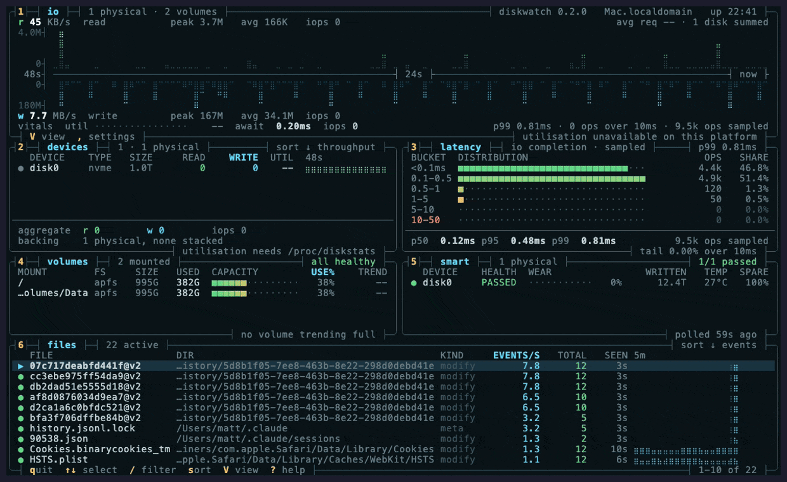

<p align="center">
  <h1 align="center">DiskWatch</h1>
  <p align="center">
    <strong>Single-host disk diagnostics in your terminal. The terminal you open when the disk light won't stop blinking — before you reach for iostat, iotop, smartctl, lsblk, df, du, and a panic.</strong>
  </p>
  <p align="center">
    <a href="https://crates.io/crates/diskwatch"></a>
    <a href="https://github.com/matthart1983/diskwatch/releases"></a>
    <a href="https://repology.org/project/diskwatch/versions"></a>
    
    
  </p>
</p>

<p align="center">
  <em>Sibling to <a href="https://github.com/matthart1983/netwatch">NetWatch</a> and <a href="https://github.com/matthart1983/syswatch">SysWatch</a>. Same chrome, same palette, same keys.</em>
</p>

<p align="center">
  
</p>

## Dense

```bash
diskwatch --dense
```

Six boxes, one screen, no chrome rows — every keybind, sort state and page counter lives in
a box border.

| Box | Shows |
|---|---|
| **io** | Mirrored read/write throughput on a shared time axis. Peak, average, iops split by direction, mean request size, utilisation, await, p99. |
| **devices** | Per-device read/write, utilisation, size, type, 48s sparkline. Stacked devices (md, dm, LVM, LUKS) are listed but excluded from totals. |
| **latency** | IO completion histogram, seven buckets from `<0.1ms` to `>50ms`, with p50/p95/p99 and the share of ops past 10 ms. Bars are coloured by bucket, not by count, so the tail is visible before it fills. |
| **volumes** | Capacity meters with a days-to-full projection from observed growth. Silent when a volume is flat or shrinking. |
| **smart** | Health, wear, host writes, temperature, spare. |
| **files** | Busiest paths by event rate. Filter with `/`, sort with `s`. |

Falls back to a compact screen below 104×32, keeping the mirror and the percentiles.

## Tabs

<p align="center">
  
</p>

| # | Tab | Shows | Replaces |
|---|---|---|---|
| 1 | Overview | KPI tiles, device summary, aggregate IO, capacity bar | — |
| 2 | Devices | model, firmware, serial, used %, SMART, per-device detail | `lsblk`, `nvme list`, `diskutil list`, `hdparm -I` |
| 3 | Volumes | APFS containers + roles; mdraid members, `[UUUU]` state, resync progress | `lvs`, `vgs`, `mdadm --detail`, `diskutil apfs list` |
| 4 | FS | mounts with usage bars, thresholds, system/user/removable | `df -h`, `df -i`, `mount`, `findmnt` |
| 5 | IO | per-device throughput, 48s sparkline, p50/p99 read and write | `iostat -x 1` |
| 6 | SMART | full NVMe/ATA attribute tables when `smartctl` is present | `smartctl -A`, `nvme smart-log` |
| 7 | Hot Files | paths by event rate (FSEvents / inotify) | `fatrace`, `fs_usage` |
| 8 | Insights | capacity, SMART, wear, temperature, latency and hot-file anomalies | — |

## Lite

```bash
diskwatch --lite
```

80×24, six keys, no tabs: read and write throughput, a capacity line that answers *how long
have I got*, and the busiest files. Sized for a tmux split or an SSH session to a NAS. Same
grid and keys as [`netwatch --lite`](https://github.com/matthart1983/netwatch).

## Install

```bash
brew install diskwatch                # macOS / Linux
nix-shell -p diskwatch                # NixOS / Nix
paru -S diskwatch                     # Arch
cargo install diskwatch               # anywhere with Rust
```

Or a pre-built binary from [Releases](https://github.com/matthart1983/diskwatch/releases/latest)
— Linux and macOS, x86_64 and aarch64, plus static musl builds.

No system dependencies on Linux. macOS uses the preinstalled `ioreg`, `diskutil` and
`system_profiler`. Optional: `smartmontools` for full SMART attribute tables; without it the
SMART tab falls back to the basic verified/failing flag.

Nix and Arch packages are maintained by community packagers — file packaging issues with
them, diskwatch bugs here. [Repology](https://repology.org/project/diskwatch/versions) shows
which are current.

<details>
<summary><strong>From source</strong></summary>

```bash
git clone https://github.com/matthart1983/diskwatch.git && cd diskwatch
cargo build --release
./target/release/diskwatch
```

Rust 1.75+.

</details>

## Keys

| Key | Action |
|---|---|
| `1`–`8` | Switch tabs |
| `V` | Cycle view: full → lite → dense |
| `L` | Jump straight to Lite |
| `↑` `↓` `j` `k` | Move selection |
| `/` | Filter files (Lite, Dense) |
| `s` | Cycle file sort (Dense) |
| `p` | Pause / resume |
| `,` | Settings — columns, temperature unit, SMART interval, theme, view |
| `r` | Force a SMART refresh |
| `?` | Help |
| `q` / `Esc` | Quit |

## Options

| Flag | |
|---|---|
| `--dense` | Start in Dense (`--v2`, `--btop` still work) |
| `--lite` | Start in Lite |
| `--view` | `full`, `lite`, `dense` |
| `--tab` | Start on a named tab |
| `--theme` | `dark` (default), `light`, `ocean`, `solarized`, `dracula`, `nord`, `terminal` |
| `--graph` | `bars` (default) or `dots` for btop-style braille |
| `--graph-fade` | btop's brightness gradient and dot grid |
| `--diag` | Print collected state and exit, no TUI |

`--theme terminal` pins no colours of its own — every slot resolves to an ANSI entry and
foreground/background use your terminal's, so pywal or a terminal profile carries through.
Theme and graph style are also live in the settings overlay; neither persists between runs,
so use the flag to make one stick.

## What's real, what's deferred

| Metric | macOS | Linux |
|---|---|---|
| Device model / serial / firmware | ✅ `system_profiler` + IOKit | ✅ `/sys/block/*/device/*` |
| Per-device used bytes | ✅ via APFS container map | ✅ summed from mounts |
| Read/write byte rates, split | ✅ IOKit `Statistics` | ✅ `/proc/diskstats` 5/9 |
| Read/write iops, split | ✅ IOKit `Operations` | ✅ `/proc/diskstats` 4/8 |
| Avg per-op latency | ✅ `Total Time / Operations` | ✅ `/proc/diskstats` 6/10 |
| p50 / p99 latency | ✅ tick-averaged over 60s | ✅ tick-averaged over 60s |
| Latency histogram, 7 buckets | ✅ tick means weighted by ops | ✅ tick means weighted by ops |
| True per-op p99 | ❌ needs IOReport entitlement | ❌ needs eBPF biolatency |
| Device utilisation (%util) | ❌ IOKit has no busy-time counter | ✅ `/proc/diskstats` 13 |
| Requests in flight | ❌ not exposed by IOKit | ✅ `/proc/diskstats` 12 |
| SMART attributes | ✅ `smartctl` if installed | ✅ `smartctl` if installed |
| Volumes — APFS / mdraid | ✅ `diskutil apfs list` | ✅ `/proc/mdstat` |
| Volumes — ZFS, LVM | ⏳ deferred | ⏳ deferred |
| Hot files — paths | ✅ FSEvents | ✅ inotify |
| Hot files — bytes / pid | ❌ needs root or entitlement | ❌ needs eBPF biosnoop |
| Capacity growth + time-to-full | ✅ 10-min usage window | ✅ 10-min usage window |

Anything a platform can't measure renders `--` and keeps its column, so the layout never
shifts between machines. Two consequences worth knowing:

- **macOS reports no utilisation.** IOKit counts service time, not time-with-IO-in-flight,
  which on a deep-queue NVMe exceeds wall clock. Dense sorts devices by throughput there and
  says so in its own border.
- **The latency histogram samples.** Each 200 ms tick contributes its op count to the bucket
  holding that tick's mean service time. It shows a sustained slow stretch; it smears a lone
  50 ms outlier into whatever its tick averaged.

## Anti-goals

- **Not multi-host.** Use NetWatch Cloud for a fleet view.
- **Not a daemon.** No background collector, no persisted DB.
- **Not a cleaner.** It surfaces what's eating disk; it deletes nothing.
- **Not a backup product.** Snapshots are observed, not authored.
- **Not a benchmark.** It measures what's happening, not what's possible.

## License

MIT.
