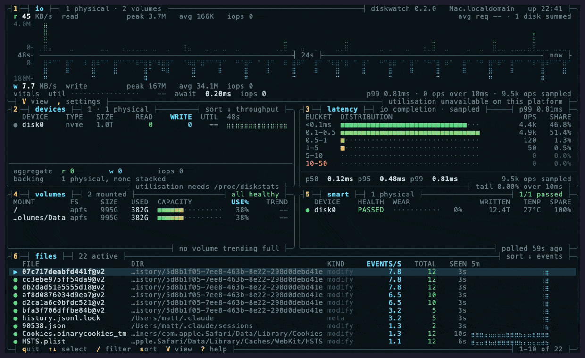

<p align="center">
  <h1 align="center">DiskWatch</h1>
  <p align="center">
    <strong>Disk diagnostics in your terminal.</strong>
  </p>
  <p align="center">
    <a href="https://crates.io/crates/diskwatch"></a>
    <a href="https://github.com/matthart1983/diskwatch/releases"></a>
    <a href="https://repology.org/project/diskwatch/versions"></a>
    
    
  </p>
</p>

<p align="center">
  
</p>

<p align="center">
  <em>Live disk activity in <code>diskwatch --dense</code>.</em>
</p>

Inspect disk activity, capacity, health and busy files. DiskWatch brings devices,
volumes, filesystems and IO into one terminal, with anomaly cards to help investigate
problems. It is read-only and needs no configuration to get started.

## Install

```bash
brew install diskwatch                # macOS / Linux
nix-shell -p diskwatch                # NixOS / Nix
paru -S diskwatch                     # Arch (AUR)
cargo install diskwatch               # build from source with Rust
x eget use matthart1983/diskwatch     # prebuilt release binary
```

[Prebuilt binaries](https://github.com/matthart1983/diskwatch/releases/latest)
are available for macOS and Linux (x86_64 and aarch64), including static Linux
builds, plus Linux armv5te and Windows x86_64.
[Build from source](docs/REFERENCE.md#install).

Install `smartmontools` for full SMART attribute tables. Without it, SMART reporting
is limited to the basic health flag where available.

## Run

```bash
diskwatch                       # eight tabs
diskwatch --lite                # one 80×24 screen
diskwatch --dense               # six panels on one screen
diskwatch --watch ~/src         # watch a specific tree instead of the defaults
diskwatch --diag                # print collected state and exit
```

`1`–`8` switch tabs, `V` cycles views, `,` opens settings, `?` shows help, `q` quits.
[Every keybinding](docs/REFERENCE.md#keys) · [All options](docs/REFERENCE.md#options)

## The tabs

| Key | Tab | Shows |
|---|---|---|
| 1 | Overview | Device summary, aggregate IO and capacity |
| 2 | Devices | Model, firmware, serial, usage and device details |
| 3 | Volumes | APFS containers, Linux mdraid state and resync progress, ZFS pools and vdevs |
| 4 | FS | Mounts, capacity and usage thresholds |
| 5 | IO | Per-device throughput, history and sampled latency |
| 6 | SMART | Drive health and available NVMe/ATA attributes |
| 7 | Hot Files | Paths ranked by event rate, with inferred process attribution |
| 8 | Insights | Capacity, health, wear, temperature and activity anomalies |

[Full-view demo](demo.gif). Available measurements vary by platform and permissions.

## Views

| View | Size | For |
|---|---|---|
| Full | Tabbed | Exploring individual devices and subsystems |
| Lite (`--lite`) | 80×24 | Throughput, capacity and busy files in an SSH session or tmux split |
| Dense (`--dense`) | Full layout at 104×32 or larger | IO, devices, latency, volumes, SMART and files together |

Dense uses a compact layout in smaller terminals. `/` filters files in Lite and
Dense; `s` cycles file sorting in Dense.
[View details](docs/REFERENCE.md#dense).

## Measurement limits

Hot Files infers the busiest process holding a path open; it does not identify the
writer of each event. Sampling can miss short-lived writers, and unprivileged
attribution is limited to your user.

Latency percentiles and histograms use sampled interval averages, not individual
IO timings. macOS does not expose the device busy-time counter used for Linux
utilisation. Unsupported measurements display `--`.
[Capability matrix](docs/REFERENCE.md#whats-real-whats-deferred).

## Docs

| | |
|---|---|
| [Reference](docs/REFERENCE.md) | Views, controls, installation and CLI options |
| [Configuration](docs/REFERENCE.md#config) | Themes, columns, refresh settings and config precedence |
| [Watch paths](docs/REFERENCE.md#watch-paths) | Watch roots, defaults and Linux inotify limits |
| [Process attribution](docs/REFERENCE.md#who-is-writing-that-file) | How Hot Files associates paths with processes |
| [Capabilities](docs/REFERENCE.md#whats-real-whats-deferred) | Platform support and measurement limits |

## Related

[NetWatch](https://github.com/matthart1983/netwatch) covers network diagnostics;
[SysWatch](https://github.com/matthart1983/syswatch) covers system activity.
They share the terminal layout and palette.

## Thanks

Community packagers maintain the Nix and Arch packages.
[Repology](https://repology.org/project/diskwatch/versions) tracks package versions.
File packaging issues with the packagers and
[DiskWatch bugs here](https://github.com/matthart1983/diskwatch/issues).

## License

MIT
